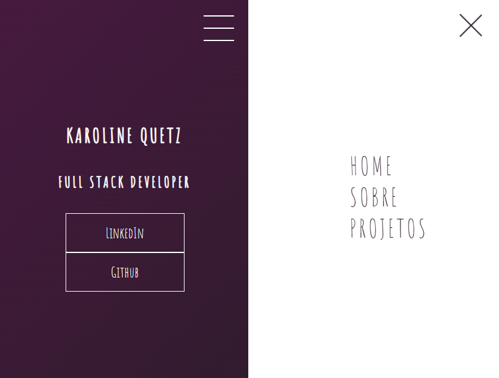

# html-css - Página de apresentação
Desenvolvido menu hamburguer e morphing menu com CSS no bootcamp da Dio.me.
https://web.dio.me/home

## Índice

- [Visão geral](#visão-geral)
  - [O projeto](#o-projeto)
  - [Screenshot](#screenshot)
- [Processo de desenvolvimento](#desenvolvimento-processo)
  - [Construído com](#construído-com)
- [Codificado por](#coded-by)

## Visão geral

### O projeto

- Menu hamburguer 
- morphing menu

### Captura de tela

## Processo de desenvolvimento

### Construído com

- HTML
- CSS

## Codificado por

- LinkedIn - [@karolinequetz](https://www.linkedin.com/in/karolinequetz)

